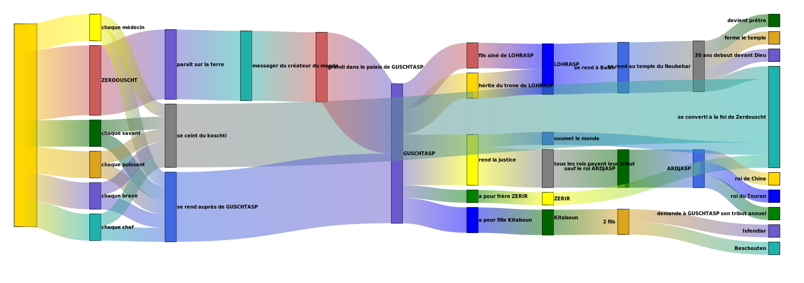

# LOHRASP

> se rend à Balkh
>
> > se rend au temple du Noubehar
> >
> > > ferme le temple
> > > devient prêtre
>
> > > 30 ans debout devant Dieu

# GUSCHTASP

- son règne dura 100 ans

> fils ainé de LOHRASP
> hérite du trone de LOHRASP
> a pour fille Kitaboun
>
> rend la justice
> soumet le monde

# Kitaboun

> 2 fils
>
> > Isfendiar
> > Beschouten

